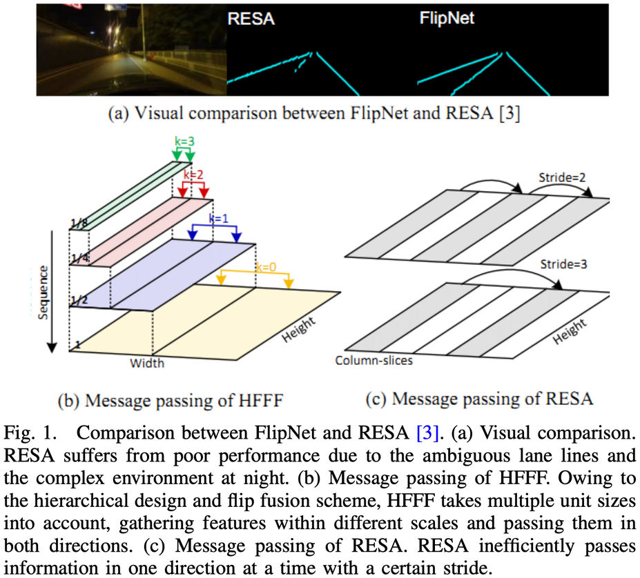

# FlipNet

PyTorch implementation of the paper "[FlipNet: An Attention-Enhanced Hierarchical
Feature Flip Fusion Network for Lane Detection](https://doi.org/10.1109/TITS.2024.3380077)" IEEE Transactions on Intelligent Transportation Systems (TITS).

## Introduction

<p align="center">
  
</p>

FlipNet detects lanes in complex environments — occlusion, discontinuous lane
appearance, and illumination variation. The main contributions of this work
can be summarized as follows:

- **Hierarchical feature flip fusion.** A hierarchical feature flip fusion
  module is developed to aggregate spatial information efficiently by
  adopting a two-way message passing scheme.
- **Double-layer attention enhancement.** A double-layer attention
  enhancement mechanism with dual-pooling coordinate attention is proposed
  to enhance subtle lane features by utilizing positional information and
  suppressing background noise.
- **State-of-the-art performance.** FlipNet achieves state-of-the-art
  performance and new best scores among segmentation-based methods on
  CULane, TuSimple, and LLAMAS benchmarks while maintaining high
  computational efficiency.

## Get started

1. Clone this repository.

2. Create a conda virtual environment and activate it (conda is optional)

    ```Shell
    conda create -n flipnet python=3.8 -y
    conda activate flipnet
    ```

3. Install dependencies

    ```Shell
    # Install pytorch first, matching your system's CUDA toolkit version
    # (pip install works too)
    conda install pytorch torchvision cudatoolkit=10.1 -c pytorch

    # Install python packages
    pip install -r requirement.txt
    ```

4. Data preparation

    Download [CULane](https://xingangpan.github.io/projects/CULane.html) and
    [Tusimple](https://github.com/TuSimple/tusimple-benchmark/issues/3). Then
    extract them to `$CULANEROOT` and `$TUSIMPLEROOT` and link them under `data/`.

    ```Shell
    cd $FLIPNET_ROOT
    mkdir -p data
    ln -s $CULANEROOT data/CULane
    ln -s $TUSIMPLEROOT data/tusimple
    ```

    For CULane, you should have this structure:
    ```
    $CULANEROOT/driver_xx_xxframe    # data folders x6
    $CULANEROOT/laneseg_label_w16    # lane segmentation labels
    $CULANEROOT/list                 # data lists
    ```

    For Tusimple, you should have this structure:
    ```
    $TUSIMPLEROOT/clips                  # data folders
    $TUSIMPLEROOT/lable_data_xxxx.json    # label json files x4
    $TUSIMPLEROOT/test_tasks_0627.json    # test tasks json file
    $TUSIMPLEROOT/test_label.json         # test label json file
    ```

    Tusimple ships polyline annotations, not per-pixel labels, so generate the
    segmentation maps first:

    ```Shell
    python tools/generate_seg_tusimple.py --root $TUSIMPLEROOT
    # this will generate a seg_label directory
    ```

5. Install the CULane evaluation tool.

    This requires OpenCV C++. Follow
    [these instructions](https://docs.opencv.org/master/d7/d9f/tutorial_linux_install.html),
    or simply `sudo apt-get install libopencv-dev`.

    Then compile the evaluator:
    ```Shell
    cd $FLIPNET_ROOT/runner/evaluator/culane/lane_evaluation
    make
    cd -
    ```

    The default `OPENCV_VERSION` in the Makefile is 3; change it to 2 if needed.

## Training

```Shell
python main.py [configs/path_to_your_config] --gpus [gpu_ids]
```

## Testing

```Shell
python main.py [configs/path_to_your_config] --validate --load_from [path_to_your_model] --gpus [gpu_ids]
```

## Visualization

Add `--view` to a testing command, e.g.:
```Shell
python main.py configs/culane_r34.py --validate --load_from flipnet_culane_r34.pth --gpus 0 --view
```
Results are written to `work_dirs/[DATASET]/xxx/vis`.

## Citation

```BibTeX
@article{wen2024flipnet,
  title={FlipNet: An Attention-Enhanced Hierarchical Feature Flip Fusion Network for Lane Detection},
  author={Wen, Yuxuan and Yin, Yunfei and Ran, Hao},
  journal={IEEE Transactions on Intelligent Transportation Systems},
  volume={25},
  number={8},
  pages={8741--8750},
  year={2024},
  publisher={IEEE},
  doi={10.1109/TITS.2024.3380077}
}
```

## Acknowledgement

The training pipeline, dataset loaders, and evaluation code in this repo are
adapted from [RESA](https://github.com/zjulearning/resa),
[SCNN](https://github.com/XingangPan/SCNN), and
[Tusimple benchmark](https://github.com/TuSimple/tusimple-benchmark).
